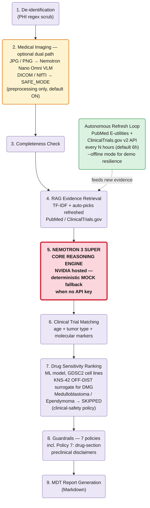

# Pediatric Neuro-Oncology Surgical Planning Agent

A runnable hackathon project for an autonomous long-agent workflow for pediatric neuro-oncology pre-operative MDT planning.

## Architecture

Top-down view of the autonomous pipeline. **Nemotron 3 Super** is the core reasoning engine; the **Autonomous Refresh Loop** runs in parallel and feeds freshly retrieved evidence into the RAG step (dashed arrow).



Mermaid source: [`assets/architecture.mmd`](assets/architecture.mmd)

## Judge Quickstart

This section provides a minimal path for judges to verify that the agent runs end-to-end. No NVIDIA API key is required for the basic demo; without `NVIDIA_API_KEY`, the system automatically uses deterministic MOCK Nemotron fallback while preserving the same agent workflow.

### 1. Clone and set up

```bash
git clone https://github.com/otonifrio2812/pediatric-neuro-oncology-agent-nemoclaw-ready.git
cd pediatric-neuro-oncology-agent-nemoclaw-ready

python -m venv .venv
source .venv/bin/activate  # Windows PowerShell: .\.venv\Scripts\Activate.ps1

pip install --upgrade pip
pip install -r requirements.txt
```

### 2. Run the agent end-to-end (no API key needed)

```bash
python run_demo.py sample_cases/case_010_pediatric_glioma_hgg.txt \
  --structured-json sample_cases/case_010_pediatric_glioma_hgg_structured.json \
  --attach-architecture
```

Expected console output:

```text
Reasoning mode: MOCK Nemotron (nvidia/nemotron-3-super-120b-a12b)
Report written: outputs/case_report_<timestamp>.md
```

Open the generated `outputs/case_report_<timestamp>.md` to read the full MDT surgical-planning report: de-identification, RAG-retrieved evidence, clinical-trial matches, guardrail-checked Nemotron reasoning, and the mandatory safety disclaimers.

### 3. (Optional) Run as an HTTP service

The deployable FastAPI wrapper exposes the same workflow over HTTP. It only needs two extra packages — the local `guardrails.py` is used, so NVIDIA NeMo Guardrails is **not** required:

```bash
pip install fastapi "uvicorn[standard]"
uvicorn app_nemoclaw:app --host 127.0.0.1 --port 8080
```

In a second terminal:

```bash
# liveness check
curl http://127.0.0.1:8080/health

# run a sample case through the API (MOCK mode, no key)
curl -X POST http://127.0.0.1:8080/run_case \
  -H "Content-Type: application/json" \
  -d @examples/run_case_payload.json
```

`/health` returns `{"status": "ok", ...}`; `/run_case` returns the agent result with `"reasoning_mode": "MOCK Nemotron (...)"` and writes the report under `outputs/`.

> This is a research prototype for demonstration only — not for clinical use. See **Safety scope** below.

## Core design

Nemotron 3 Super is the core clinical reasoning model. Other modules are upstream tools:

- `image_analysis.py`: optional JPG/PNG image-to-text using NVIDIA OpenAI-compatible VLM endpoint.
- `advanced_medical_imaging.py`: optional DICOM/NIfTI research-prototype advanced imaging module.
- `drug_ranking_adapter.py`: optional preclinical drug-ranking appendix adapter.
- `literature_trial_updater.py`: autonomous PubMed / ClinicalTrials.gov evidence refresh.
- `rag.py`: retrieval-augmented generation (RAG) layer; retrieves evidence chunks from `knowledge_base/` and `rag_sources/` for Nemotron reasoning and the MDT report.
- `watcher.py` / `autonomous_refresh_loop.py`: autonomous watcher that refreshes the knowledge base and evidence, then auto-triggers an agent run and report generation.
- `guardrails.py`: policy-based medical safety checks.

## Retrieval-Augmented Generation (RAG)

The project includes a RAG retrieval layer (`rag.py`). On each case run it retrieves the most relevant evidence chunks from the local `knowledge_base/` (curated guideline / abstract summaries) and `rag_sources/` (autonomously refreshed evidence), and supplies them to **Nemotron 3 Super** as grounding context for clinical reasoning. The retrieved chunks are cited in the generated **MDT report** (see the "Retrieved Evidence" section of each report) so every evidence item is traceable. Retrieval uses TF-IDF when scikit-learn is available and falls back to a lightweight keyword scorer otherwise, so it runs with or without optional dependencies.

## Safety scope

This repository is a research prototype for hackathon demonstration. It does not provide a definitive diagnosis, prescription, or operative plan. All outputs require independent review by radiology, neurosurgery, pediatric neuro-oncology, pharmacy, and the MDT.

## Quick start in Colab

Upload this zip in Step 1 of the notebook. The notebook looks for a file matching:

```python
/content/*pediatric-neuro-oncology-agent*.zip
```

Then it extracts to:

```text
/content/pediatric-neuro-oncology-agent
```

## Local quick start

```bash
pip install -r requirements.txt
python run_demo.py sample_cases/case_003_diffuse_midline_glioma.txt
```

Without `NVIDIA_API_KEY`, the project runs in MOCK mode. With an API key:

```bash
export NVIDIA_API_KEY="nvapi-..."
export NEMOTRON_MODEL="nvidia/nemotron-3-super-120b-a12b"
python run_demo.py sample_cases/case_003_diffuse_midline_glioma.txt
```

## DICOM / NIfTI advanced imaging

```bash
python run_demo.py sample_cases/case_003_diffuse_midline_glioma.txt --medical-study medical_inputs/my_study_or_nii
```

Or directly:

```bash
python advanced_medical_imaging.py medical_inputs/my_study_or_nii --output-dir outputs
```

The segmentation and anatomic landmarks are heuristic placeholders, not validated clinical models. Replace with MONAI/nnUNet/atlas registration before any formal research use.

## Autonomous watcher & refresh loop

The project ships an autonomous watcher component (`watcher.py`) plus a scheduler/driver (`autonomous_refresh_loop.py`). Together they perform knowledge-base and evidence refresh (PubMed / ClinicalTrials.gov) and then **automatically trigger an agent run and MDT report generation** — demonstrating end-to-end autonomous long-agent behavior with no human in the loop.

```bash
python autonomous_refresh_loop.py --once
# or persistent
python autonomous_refresh_loop.py --interval-hours 6
```

This refreshes PubMed / ClinicalTrials.gov evidence sources (updating `rag_sources/`, which the RAG layer retrieves from) and then runs the agent watcher, which picks up new inputs and generates reports automatically.

## Hackathon fit

The workflow supports autonomous operation, Nemotron core reasoning, real tasks (retrieval, automation, analysis, orchestration, reporting), deployability in Colab/local/cloud, and policy-based guardrails.
